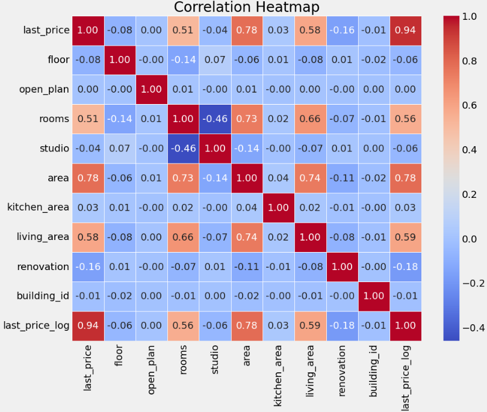

# Final Project: "Predicting Real Estate Data in St. Petersburg"

## 1) Description

### 1.1) Project Goal

Real estate rent price forecasting in St. Petersburg

### 1.2) Dataset

We have data from Yandex.Realty classified https://realty.yandex.ru containing real estate listings for apartments in St. Petersburg and Leningrad Oblast from 2016 till the middle of August 2018.

### 1.3) Project Tasks

- Analyze the source data and provide some statistics
- Train the model to predict real estate price
- Use virtual environment on the remote machine
- Run the application in Docker containter

## 2) Data analytics

### 2.1) Cleaning the source data

The data initially contained <b>429187</b> rows and <b>17</b> columns:


Column information:

1. offer_id: Unique identifier of the real estate offer/offer.
2. first_day_exposition: The date the offer was first posted.
3. last_day_exposition: The date the offer was last posted.
4. last_price: The last price of the property.
5. floor: The floor on which the property is located.
6. open_plan: Flag indicating if the layout is open.
7. rooms: The number of rooms in the property.
8. studio: Flag indicating if the property is a studio. 
9. area: The total area of the property.
10. kitchen_area: The area of the kitchen.
11. living_area: Living area.
12. agent_fee: Agent's commission.
13. renovation: Renovation costs.
14. offer_type: 2 - RENT, 1 - SELL
15. category_type: Category type.
16. unified_address: The unified address of the property.
17. building_id: Unique building identifier.

The dataset contained information on both real estate sales and rentals.  Therefore, it was decided to split the dataset into two parts. And also to process it, remove duplicates and get rid of outliers. 

### 2.2) Data preprocessing

Cleaned dataset contains <b>156054</b> records of rent data in Saint Petersburg city limits.

The last price visualisation:


The target variable last_price is not normally distributed. So I desided to take the logarighm of the target variable: 


Dataset contained some missing values:


So I filled in the empty values and deleted unnecessary columns. Here you can see statistics:


Based on statistics it can be seen that the maximum value of floors reaches 92, which is noticeably higher than the real maximum value in St. Petersburg.

### 2.3) Visualization

Scatter Plots:




Final stucture:


I will use floor, rooms, area and renovation features to predict last_price in my model.

## 3) Model building: 

I have tried several models: Decision Tree Regressor, Random Forest Regressor, Gradient Boosting Regressor, XG Boost Regressor. I didn't use specific params at first and I have got the results:


Based on the result I decided to tune Gradient Boost Regressor. I used GridSearchCV to find the best hyperparameters:


And the result was:

- MAE: 0.359
- MSE: 0.356
- RMSE: 0.596

## 4) Install and run the application

1. Update the list of available packages
```
sudo apt-get update 
```
2. Install python pip
```
sudo apt install python3-pip
```
3. Create virtual environment in application folder
```
python3 -m venv env
```
4. Activate virtual environment
```
source env/bin/activate
```
5. Install all requirenments
```
pip install -r requirenments.txt
```
6. Run the application
```
python3 app.py
``` 

#### Test application using postman:


## 5) Dockerfile

Dockerfile contains information about application container:
- image is ubuntu v22.04
- it copies all the content to opt/gsom_predictor folder
- installs all the dependensies 
- and runs the application

```
FROM ubuntu:22.04
MAINTAINER Dmitrii Borisov 
RUN apt-get update -y 
COPY . /opt/gsom_predictor 
WORKDIR /opt/gsom_predictor 
RUN apt install -y python3-pip 
RUN pip3 install -r requirements.txt 
CMD python3 app.py
```
## 6) How to run app using docker and open the port

1. Connect to your remote machine:
```
ssh <login>@<your_vm_address>
```
2. Open the port:
```
sudo ufw allow 5444
```
3. Run the container:
```
docker run --network host -d borisovgsom/gsom_e2e:v.0.1
```
Working example:


